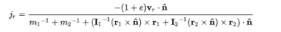
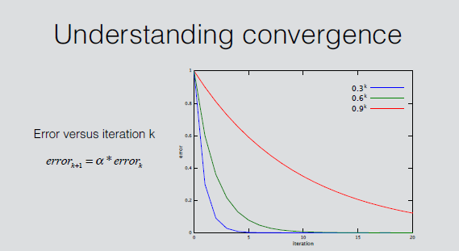

# CubeSimulator

Simulate the motion of a cube after it hits the ground by impulse-based collision response.

## 项目结构

| 文件               | 内容                             |
| ------------------ | -------------------------------- |
| PhysicsFormula.hpp | 物理公式，如计算冲量、旋转等     |
| PhysicsState.hpp   | 数据结构，如运动属性、碰撞点集等 |
| PhysicsSim.hpp     | 模拟运动                         |
| Cube.cpp           | 在 unreal 中展示                 |

## 物理理论

- 基于冲量的模拟

  - 计算碰撞冲量大小：
    - [Collision Response](https://en.wikipedia.org/wiki/Collision_response)

<center>
    <div style="display:inline">
        
    </div>
    <br>
    <div style="color:orange; border-bottom: 1px solid #d9d9d9; display: inline-block; color: #999; padding: 2px;">
        Collision Response
    </div>
</center>

根据当前的速度、碰撞点位置以及相对位置可以计算出冲量大小

- 连续冲量
  - [ErinCatto - UnderstandingConstraints_GDC2014](https://box2d.org/files/ErinCatto_UnderstandingConstraints_GDC2014.pdf)
  <center>
      <div style="display:inline">
          
      </div>
      <br>
      <div style="color:orange; border-bottom: 1px solid #d9d9d9; display: inline-block; color: #999; padding: 2px;">
          Sequential Impulses
      </div>
  </center>

以碰撞点集合中碰撞点任意的顺序来对接触冲量进行求解，如果要一次性分析时间复杂度很高，用这种近似的方式可能有误差，因此多次迭代，最终可以趋近理想结果

- 碰撞点集

  - 如果每次只处理一个碰撞点，那么在每一帧都有新的旋转量，导致持续不断的抖动，类似于长尾效应
  - 因此设置碰撞点集合，最大有四个碰撞点，让正方体在多碰撞点作用下尽快稳定
  - 产生新碰撞点时的替换策略

    1. 最深的碰撞点保留
    2. 计算与此碰撞点构成的最大三角形的两个点
    3. 另外一个点替换

```c++
uint32_t get_remove_idx(uint32_t deepest_idx, Vector3f& hit_point) {
    if (POINT_NUM != 4)
        return -1;

    float area[4];
    for (uint32_t i = 0; i < 4; i++) {
        Vector3f vec1 = hit_point - point_set[(i + 1) % 4].hit_point;
        Vector3f vec2 = point_set[(i + 2) % 4].hit_point -
                        point_set[(i + 3) % 4].hit_point;
        area[i] = vec1.cross(vec2).norm();
    }
    area[deepest_idx] = 0.f;

    uint32_t idx = deepest_idx;
    float max_area = 0.f;
    for (uint32_t i = 0; i < 4; i++) {
        if (max_area <= area[i]) {
            idx = i;
            max_area = area[i];
        }
    }
    return idx;
}
```

- 旋转

在计算出角速度后，以下流程更新物体的 quaternion，逻辑是得到角速度在 delta_time 转过的角度 angle，以及角速度的方向 axis，得到在 delta_time 的朝向改变，然后相乘即得到新的朝向

```c++
float angular_vel_norm = dynamic_state->angular_vel.norm();
float angular_delta_angle = angular_vel_norm * delta_time;
Vector3f angular_vel_axis =
    angular_delta_angle > MIN_DELTA_ANGLE
        ? dynamic_state->angular_vel / angular_vel_norm
        : normalized_Z;
Quaternionf delta_quat;
set_quat(angular_delta_angle, angular_vel_axis, &delta_quat);
actor_state->quat = delta_quat * actor_state->quat;
```

在 unreal 中，actor 的位置不一定是中心点，所以在处理使用局部坐标系，得到 actor 位置到中心点位置的相对位置，在局部坐标系中以算出的 quaternion 旋转，得到在世界坐标系的位置

```c++
inline void cal_point_location(ActorState* actor_state,
                               Vector3f relative_vec,
                               Vector3f* location) {
    if (!location || !actor_state)
        return;

    *location = (actor_state->origin) + (actor_state->quat) * relative_vec;
}
```

## 模拟流程

- 更新碰撞点集合

```c++
// update point
cube_physics->update_hit_point_set();
```

策略为：

1. 如果当前没有碰撞，则清掉碰撞点
2. 如果碰撞发生时中心点的位置离当前碰撞点过远，则清掉碰撞点

```c++
void update_point(Vector3f origin) {
    for (uint32_t i = 0; i < size; i++) {
        Vector3f cur_hit_point = origin + point_set[i].relative_location;
        Vector3f pre_origin =
            point_set[i].hit_point - point_set[i].relative_location;
        bool still_collision = ((base - cur_hit_point.z()) > 0);
        bool still_close = ((pre_origin - origin).norm() < MIN_DISTANCE);
        if (!still_collision || !still_close)
            remove_element(i);
    }
}
```

- 作用重力

```c++
// apply gravity
cube_physics->resolve_gravity();
```

首先施加重力，得到更新后的速度

- 碰撞检测

```c++
FCollisionShape CollisionShape =
        FCollisionShape::MakeBox(Eigen2FVector(cube_physics->get_box_extent()));
GetWorld()->OverlapMultiByChannel(
        OutOverlaps, Eigen2FVector(cube_physics->get_origin()),
        Eigen2FQuat(cube_physics->get_quat()),
        ECollisionChannel::ECC_WorldStatic, CollisionShape);
```

OverlapMultiByChannel 函数检测当前物体与其他物体是否有碰撞

- 碰撞点获取

如果碰撞发生在表面，可以用 SweepSingleByChannel 检测出碰撞点

```c++
bHasHit = GetWorld()->SweepSingleByChannel(
            Hit, origin, Eigen2FVector(sim_origin),
            GetActorRotation().Quaternion(),
            ECollisionChannel::ECC_WorldStatic, CollisionShape);
```

如果碰撞发生在内部，即穿模、陷入，通过 cal_deepest_point 检测

```c++
void cal_deepest_point(ActorProperty* actor_property,
                              ActorState* actor_state,
                              Vector3f* hit_point) {
    int min_z = numeric_limits<int>::max();
    Vector3f relative_vec;
    Vector3f location;

    for (int x = 0; x < 2; x++) {
        for (int y = 0; y < 2; y++) {
            for (int z = 0; z < 2; z++) {
                relative_vec.x() = pow(-1, x) * actor_property->box_extent(0);
                relative_vec.y() = pow(-1, y) * actor_property->box_extent(1);
                relative_vec.z() = pow(-1, z) * actor_property->box_extent(2);
                cal_point_location(actor_state, relative_vec, &location);
                if (location.z() < min_z) {
                    *hit_point = location;
                    min_z = location.z();
                }
            }
        }
    }
}
```

逻辑是，找到当前状态-z 轴方向最深的顶点，视为碰撞点

- warmstart

```c++
warmstart
cube_physics->warm_start();
```

把累计下来的上一帧总冲量在开始新帧的碰撞处理前提前在物体上作用一次，可以增加稳定性

```c++
void warm_start() {
    for (int i = 0; i < ITERATION_NUM; i++) {
        for (uint32_t j = 0; j < POINT_NUM; j++) {
            ImpactPoint* point = impact_point_set.get_point(j);
            if (point && (point->cache)) {
                update_dynamic(point->impluse_vertical,
                               point->angular_inertia_vertical,
                               actor_property->mass, dynamic_state);
                update_dynamic(point->impluse_horizontal,
                               point->angular_inertia_horizontal,
                               actor_property->mass, dynamic_state);
            }
        }
    }
}
```

- 用公式处理碰撞

```c++
// handle collision
cube_physics->resolve_collision();
```

做 ITERATION_NUM 次迭代，多次迭代可以得到更接近的速度

```c++
 void resolve_collision() {
    for (int i = 0; i < ITERATION_NUM; i++) {
        for (uint32_t j = 0; j < POINT_NUM; j++) {
            ImpactPoint* point = impact_point_set.get_point(j);
            if (point) {
                cal_point_collision(actor_property, actor_state, point,
                                    delta_time, dynamic_state);
            }
        }
    }
}
```

- 更新运动位置

```c++
// update state
cube_physics->update_actor_state();
```

由上述计算得到了当前帧最新的速度信息，用这个速度更新当前帧的位置和朝向

- unreal 中展示

```c++
// set
FVector location = Eigen2FVector(cube_physics->get_location());
FQuat quat = Eigen2FQuat(cube_physics->get_quat());

SetActorLocationAndRotation(location, quat.Rotator());
```

转化为 unreal 中的数据结构并展示

## 结果演示

[](https://www.youtube.com/watch?v=-5taZROaKtw)
